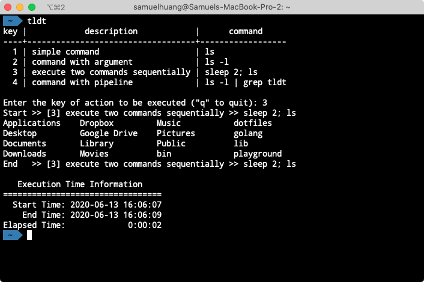

TL;DT
=====

> Too Long; Didn't Type
 
Do you maintain a note to collect a bunch of commands? And copy/paste when you want to use it?

`tldt` can help you collect commands that are long and difficult to remember. You can view all of these on command-line and enter the key you define for each command. `tldt` will execute it and show the execution time information for you!



Prerequisite
------------

Create a `.tldt.json` file and place in wherever you would like to execute(e.g., root path of a project ).

You can follow the example [.tldt.json](.tldt.json) file to create your own one.

```json5
{
  "configuration": {
    "sortByKey": true // whether sort action by key in ascending before displaying
  },
  "actions": [
    {
      "key": "1", // Shortcut key for the command
      "description": "Support argument and pipeline", // Describe the command
      "command": "sleep 2; ls -l | grep app" // Actually executed command
    },
    // other actions
  ]
}
```

Usage
-----

View all of commands on command-line:

```text
$ tldt
```

Execute specific command directly

```text
$ tldt [key]
```  

Command Argument
----------------

```
usage: tldt [-h] [--version] [--no-time] [key]

Too Long; Didn't Type.

positional arguments:
  key             a key of the action

optional arguments:
  -h, --help      show this help message and exit
  --version, -v   show program's version number and exit
  --no-time, -nt  don't show execution time information
```

Dependency
----------

- python3

Install
-------

Get the script

- Manually
  - Download the `tldt.py` and place it on your `PATH`
  - Rename to `tldt` (remove filename extension `.py`

License
-------

```
Copyright 2020 Samuel Huang

Licensed under the Apache License, Version 2.0 (the "License");
you may not use this file except in compliance with the License.
You may obtain a copy of the License at

    https://www.apache.org/licenses/LICENSE-2.0

Unless required by applicable law or agreed to in writing, software
distributed under the License is distributed on an "AS IS" BASIS,
WITHOUT WARRANTIES OR CONDITIONS OF ANY KIND, either express or implied.
See the License for the specific language governing permissions and
limitations under the License.
```
